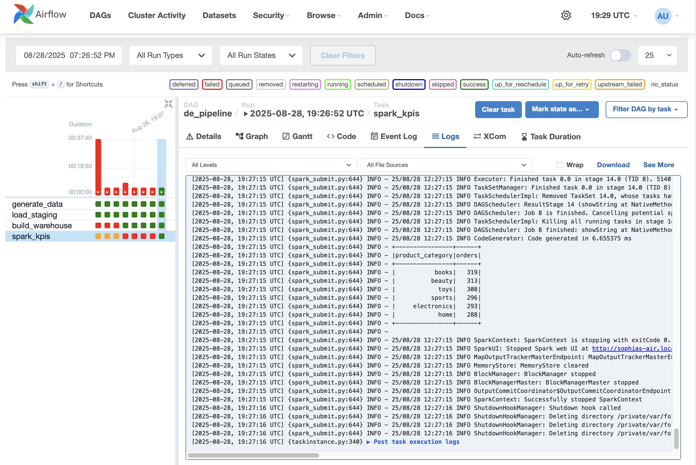

# Data Warehouse Pipeline with Airflow, Spark & Postgres

This project demonstrates a **modern data engineering pipeline** built with:

- **Airflow** for orchestration  
- **Postgres** for staging and warehouse layers  
- **Spark** for batch KPI analytics  
- **Python** for ETL jobs  

It’s designed as a hands-on portfolio project to showcase **data engineering fundamentals**: ingestion, transformation, orchestration, and analytics.

---

## 📸 Demo

Here’s a screenshot of the pipeline running successfully in **Airflow** (`de_pipeline` DAG):

  
_Screenshot: Successful DAG run in Airflow_

---

## 🏗️ Pipeline Overview

1. **Generate Data**  
   Python scripts generate synthetic `customers` and `orders` datasets (using Faker).

2. **Load to Staging (Postgres)**  
   CSVs are loaded into `staging.customers` and `staging.orders` tables.

3. **Build Warehouse**  
   SQL transformations create a classic star schema:  
   - Dimension: `warehouse.dim_customer`  
   - Fact: `warehouse.fact_orders`  

4. **Analytics with Spark**  
   Spark reads the warehouse tables via JDBC and produces KPIs:
   - Revenue by day  
   - Orders by region  
   - Top product categories  

---

## ⚙️ Tech Stack

- **Airflow 2.x** (DAG orchestration)  
- **Postgres** (staging + warehouse)  
- **PySpark 3.5.x** (batch analytics, JDBC integration)  
- **Docker Compose** (Postgres container)  
- **Python 3.9** (ETL scripts)  

---

## 🚀 Running the Project in Airflow

1. **Start Postgres**  
```bash
   docker compose up -d postgres
```

2. **Run Airflow**
```bash
airflow standalone
```

3. **Trigger the DAG**
- Go to http://localhost:8080
- Enable and trigger de_pipeline

## ▶️ Getting Started Locally

### 1. Setup environment
```bash
python3 -m venv .venv && source .venv/bin/activate
pip install -r requirements.txt
```

### 2. Start Postgres
```bash
docker compose up -d
```

### 3. Generate mock data
```bash
python etl/generate_orders.py
```

### 4. Load into staging schema
```bash
python etl/load_to_postgres.py
```

### 5. Build warehouse schema

Run the SQL script (from psql or your IDE).

### 6. Run PySpark KPIs

Download postgres jar and replace SPARK_HOME with full path of installed spark
```bash
$SPARK_HOME/bin/spark-submit --jars ~/spark_jars/postgresql-42.7.4.jar spark/kpi.py
```
---
## 🎓 Learning Outcomes

This project demonstrates:
- End-to-end ETL: raw → staging → warehouse → analytics
- SQL schema design: star schema (fact + dimensions)
- PySpark analytics: batch aggregations & cleaning
- Data quality handling: type casting, null normalization
- Data engineering workflows